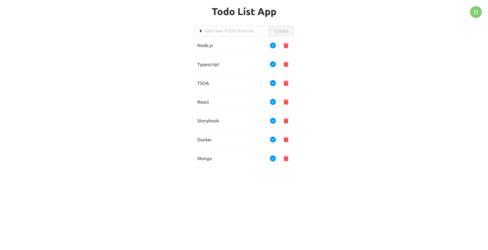

# TODO List App

Example TODO List App built with:

* ⬢ Node
* ⚔️ Typescript
* 📦 TSOA
* 🪝 React
* 📘 Storybook
* 🐳 Docker + Docker Compose
* 🗄️ MongoDB



------

🚀 Start locally by running:
```bash
docker-compose up
```

# Local Development

In *backend* directory place ```.env``` file with:
```
NODE_ENV=local

DATABASE_URI=mongodb://localhost:27017/todos

SERVICE_PORT=3000
SERVICE_ENABLE_SWAGGER=true

AUTH_JWT_SECRET=ZYsASrsVze3yNVnG37ej8ZEr9z9rT3VC4FCKxJHNnR6XAtXSwnJYN2J3Vj46MeAU
AUTH_JWT_EXPIRES_IN=86400
AUTH_JWT_AUDIENCE=todolist
AUTH_JWT_ISSUER=todolist
```

And in *client* directory place ```.env``` file with:
```
PORT=3010
```